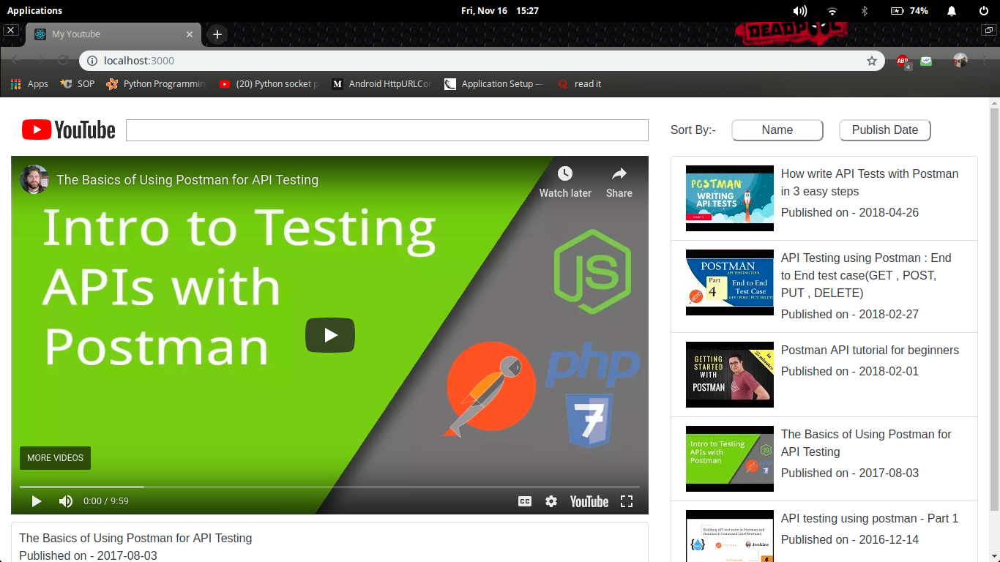

# Youtube Search Application &middot;    

## Youtube Search Application which sorts the video list on the basis of Title and Published Date.

### About
MyYoutube-UI uses Youtube-Data-Api-v3 which provides a text-box for the user to enter a search term. Returned results are sortable based on 2 parameters - eg. name and published date.

### User Interface

### Video Demo
You can find the video demo here :- [Video Demo](https://youtu.be/VWpzR_xrvuQ)

### Online Hosting
You can find the live hosting application here : [Youtube Search App](https://youtube-postman.netlify.com/)

### Steps to Run
 - Clone the repository
 - Open directory
 - Run - npm install
 - Run - npm start
 - Go to browser ("localhost:3000")

### Under the hood
 - Built using [React](https://reactjs.org/)

### Creator
[Yash Bhatia](https://github.com/YashBhatia97) 
